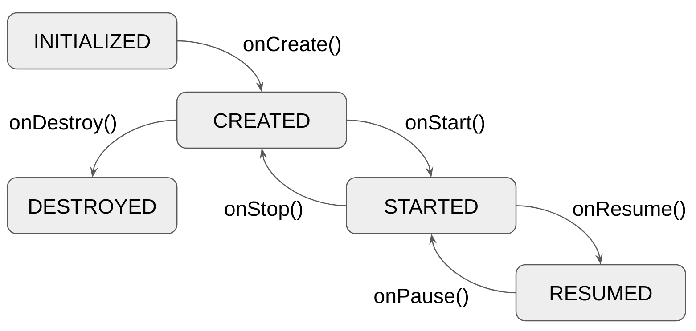

[](https://search.maven.org/search?q=g:com.arkivanov.essenty)
[](http://www.apache.org/licenses/LICENSE-2.0)
[](https://twitter.com/arkann1985)

# Essenty

The most essential libraries for Kotlin Multiplatform development.

Supported targets:

- `android`
- `jvm`
- `js` (`IR` and `LEGACY`)
- `iosArm64`, `iosX64`
- `watchosArm32`, `watchosArm64`, `watchosX64`
- `tvosArm64`, `tvosX64`
- `macosX64`
- `linuxX64`

## Lifecyle

When writing Kotlin Multiplatform (common) code we often need to handle lifecycle events of a screen. For example, to stop background operations when the screen is destroyed, or to reload some data when the screen is activated. Essenty provides the `Lifecycle` API to help with lifecycle handling in the common code. It is very similar to [Android Activity lifecycle](https://developer.android.com/guide/components/activities/activity-lifecycle).

### Setup

Groovy:
```groovy
// Add the dependency, typically under the commonMain source set
implementation "com.arkivanov.essenty:lifecycle:<essenty_version>"
```

Kotlin:
```kotlin
// Add the dependency, typically under the commonMain source set
implementation("com.arkivanov.essenty:lifecycle:<essenty_version>")
```

### Lifecycle state transitions



### Content

The main [Lifecycle](https://github.com/arkivanov/Essenty/blob/master/lifecycle/src/commonMain/kotlin/com/arkivanov/essenty/lifecycle/Lifecycle.kt) interface provides ability to observe the lifecycle state changes. There are also handy [extension functions](https://github.com/arkivanov/Essenty/blob/master/lifecycle/src/commonMain/kotlin/com/arkivanov/essenty/lifecycle/LifecycleExt.kt) for convenience.

The [LifecycleRegistry](https://github.com/arkivanov/Essenty/blob/master/lifecycle/src/commonMain/kotlin/com/arkivanov/essenty/lifecycle/LifecycleRegistry.kt) interface extends both the `Lifecycle` and the `Lifecycle.Callbacks` at the same time. It can be used to manually control the lifecycle, for example in tests. You can also find some useful [extension functions](https://github.com/arkivanov/Essenty/blob/master/lifecycle/src/commonMain/kotlin/com/arkivanov/essenty/lifecycle/LifecycleRegistryExt.kt).

The [LifecycleOwner](https://github.com/arkivanov/Essenty/blob/master/lifecycle/src/commonMain/kotlin/com/arkivanov/essenty/lifecycle/LifecycleOwner.kt) just holds the `Lifecyle`. It may be implemented by an arbitrary class, to provide convenient API.

#### Android extensions

From Android, the `Lifecycle` can be obtained by using special functions, can be found [here](https://github.com/arkivanov/Essenty/blob/master/lifecycle/src/androidMain/kotlin/com/arkivanov/essenty/lifecycle/AndroidExt.kt).

### Usage example

#### Observing the Lifecyle

The lifecycle can be observed using its `subscribe`/`unsubscribe` methods:

```kotlin
import com.arkivanov.essenty.lifecycle.Lifecycle

class SomeLogic(lifecycle: Lifecycle) {
    init {
        lifecycle.subscribe(
            object : Lifecycle.Callbacks {
                override fun onCreate() {
                    // Handle lifecycle created
                }

                // onStart, onResume, onPause, onStop are also available

                override fun onDestroy() {
                    // Handle lifecycle destroyed
                }
            }
        )
    }
}
```

Or using the extension functions:

```kotlin
import com.arkivanov.essenty.lifecycle.Lifecycle
import com.arkivanov.essenty.lifecycle.doOnCreate
import com.arkivanov.essenty.lifecycle.doOnDestroy
import com.arkivanov.essenty.lifecycle.subscribe

class SomeLogic(lifecycle: Lifecycle) {
    init {
        lifecycle.subscribe(
            onCreate = { /* Handle lifecycle created */ },
            // onStart, onResume, onPause, onStop are also available
            onDestroy = { /* Handle lifecycle destroyed */ }
        )

        lifecycle.doOnCreate {
            // Handle lifecycle created
        }

        // doOnStart, doOnResume, doOnPause, doOnStop are also available

        lifecycle.doOnDestroy {
            // Handle lifecycle destroyed
        }
    }
}
```

#### Using the LifecycleRegistry manually

A default implementation of the `LifecycleRegisty` interface can be instantiated using the corresponding builder function:

```kotlin
import com.arkivanov.essenty.lifecycle.LifecycleRegistry
import com.arkivanov.essenty.lifecycle.resume
import com.arkivanov.essenty.lifecycle.destroy

val lifecycleRegistry = LifecycleRegistry()
val someLogic = SomeLogic(lifecycleRegistry)

lifecycleRegistry.resume()

// At some point later
lifecycleRegistry.destroy()
```

## Parcelable and Parcelize

Essenty brings both [Android Parcelable](https://developer.android.com/reference/android/os/Parcelable) interface and the `@Parcelize` annotation from [kotlin-parcelize](https://developer.android.com/kotlin/parcelize) compiler plugin to Kotlin Multiplatform, so they both can be used in common code. This is typically used for state/data preservation over [Android configuration changes](https://developer.android.com/guide/topics/resources/runtime-changes), when writing common code targeting Android.

### Setup

Groovy:
```groovy
plugins {
    id "kotlin-parcelize" // Apply the plugin for Android
}

// Add the dependency, typically under the commonMain source set
implementation "com.arkivanov.essenty:parcelable:<essenty_version>"
```

Kotlin:
```kotlin
plugins {
    id("kotlin-parcelize") // Apply the plugin for Android
}

// Add the dependency, typically under the commonMain source set
implementation("com.arkivanov.essenty:parcelable:<essenty_version>")
```

### Usage example

Once the dependency is added and the plugin is applied, we can use it as follows:

```kotlin
// In commonMain

import com.arkivanov.essenty.parcelable.Parcelable
import com.arkivanov.essenty.parcelable.Parcelize

@Parcelize
data class User(
    val id: Long,
    val name: String
) : Parcelable
```

When compiled for Android, the `Parcelable` implementation will be generated automatically. When compiled for other targets, it will be just a regular class without any extra generated code.

#### Custom Parcelers

If you don't own the type that you need to `@Parcelize`, you can write a custom `Parceler` for it (similar to [kotlin-parcelize](https://developer.android.com/kotlin/parcelize#custom_parcelers)).

```kotlin
// In commonMain

import com.arkivanov.essenty.parcelable.Parceler
import kotlinx.datetime.Instant

internal expect object InstantParceler : Parceler<Instant>
```

```kotlin
// In androidMain

import com.arkivanov.essenty.parcelable.Parceler
import kotlinx.datetime.Instant

internal actual object InstantParceler : Parceler<Instant> {
    override fun create(parcel: Parcel): Instant = 
        Instant.fromEpochSeconds(parcel.readLong())

    override fun Instant.write(parcel: Parcel, flags: Int) {
        parcel.writeLong(epochSeconds) 
    }
}
```

```kotlin
// In all other sources (or in a custom nonAndroidMain source set)

internal actual object InstantParceler : Parceler<Instant>
```

Which can be used as follows:

```kotlin
// In commonMain

import com.arkivanov.essenty.parcelable.Parcelable
import com.arkivanov.essenty.parcelable.Parcelize
import com.arkivanov.essenty.parcelable.WriteWith
import kotlinx.datetime.Instant

@Parcelize
data class User(
    val id: Long,
    val name: String,
    val dateOfBirth: @WriteWith<InstantParceler> Instant,
) : Parcelable
```

#### Parcelize for Darwin/Apple targets

Currently there is no extra code generated when compiled for Darwin/Apple targets. However I made a proof of concept: [kotlin-parcelize-darwin](https://github.com/arkivanov/kotlin-parcelize-darwin) compiler plugin. It is not used yet by Essenty, and the applicabilty is being considered. Please raise a [Discussion](https://github.com/arkivanov/Essenty/discussions) if you are interested.

## StateKeeper

When writing common code targetting Android, it might be required to preserve some data over Android configuration changes or process death. For this purpose, Essenty provides the `StateKeeper` API, which is inspired by the AndroidX [SavedStateHandle](https://developer.android.com/reference/androidx/lifecycle/SavedStateHandle).

> ⚠️  The `StateKeeper` API relies on the `Parcelable` interface provided by the `parcelable` module described above. It can fail in non-instrumented Android tests (unit tests). Consider using your own test implementations or mocks.

### Setup

Groovy:
```groovy
// Add the dependency, typically under the commonMain source set
implementation "com.arkivanov.essenty:state-keeper:<essenty_version>"
```

Kotlin:
```kotlin
// Add the dependency, typically under the commonMain source set
implementation("com.arkivanov.essenty:state-keeper:<essenty_version>")
```

### Content

The main [StateKeeper](https://github.com/arkivanov/Essenty/blob/master/state-keeper/src/commonMain/kotlin/com/arkivanov/essenty/statekeeper/StateKeeper.kt) interface provides ability to register/unregister state suppliers, and also to consume any previously saved state. You can also find some handy [extension functions](https://github.com/arkivanov/Essenty/blob/master/state-keeper/src/commonMain/kotlin/com/arkivanov/essenty/statekeeper/StateKeeperExt.kt).

The [StateKeeperDispatcher](https://github.com/arkivanov/Essenty/blob/master/state-keeper/src/commonMain/kotlin/com/arkivanov/essenty/statekeeper/StateKeeperDispatcher.kt) interface extens `StateKeeper` and  allows state saving, by calling all registered state providers.

The [StateKeeperOwner](https://github.com/arkivanov/Essenty/blob/master/state-keeper/src/commonMain/kotlin/com/arkivanov/essenty/statekeeper/StateKeeperOwner.kt) interface is just a holder of `StateKeeper`. It may be implemented by an arbitrary class, to provide convenient API.

#### Android extensions

From Android side, `StateKeeper` can be obtained by using special functions, can be found [here](https://github.com/arkivanov/Essenty/blob/master/state-keeper/src/androidMain/kotlin/com/arkivanov/essenty/statekeeper/AndroidExt.kt).

### Usage example

#### Using the StateKeeper

```kotlin
import com.arkivanov.essenty.parcelable.Parcelable
import com.arkivanov.essenty.parcelable.Parcelize
import com.arkivanov.essenty.statekeeper.StateKeeper
import com.arkivanov.essenty.statekeeper.consume

class SomeLogic(stateKeeper: StateKeeper) {
    // Use the saved State if any, otherwise create a new State
    private var state: State = stateKeeper.consume("SAVED_STATE") ?: State()

    init {
        // Register the State supplier
        stateKeeper.register("SAVED_STATE") { state }
    }

    @Parcelize
    private class State(
        val someValue: Int = 0
    ) : Parcelable
}
```

#### Using the StateKeeperDisptacher manually

A default implementation of the `StateKeeperDisptacher` interface can be instantiated using the corresponding builder function:

```kotlin
import com.arkivanov.essenty.parcelable.ParcelableContainer
import com.arkivanov.essenty.statekeeper.StateKeeper
import com.arkivanov.essenty.statekeeper.StateKeeperDispatcher

val stateKeeperDispatcher = StateKeeperDispatcher(/*Previously saved state, or null*/)
val someLogic = SomeLogic(stateKeeperDispatcher)

// At some point later
val savedState: ParcelableContainer = stateKeeperDispatcher.save()
```

## InstanceKeeper

When writing common code targetting Android, it might be required to retain objects over Android configuration changes. This use case is covered by the `InstanceKeeper` API, which is similar to the AndroidX [ViewModel](https://developer.android.com/topic/libraries/architecture/viewmodel).

### Setup

Groovy:
```groovy
// Add the dependency, typically under the commonMain source set
implementation "com.arkivanov.essenty:instance-keeper:<essenty_version>"
```

Kotlin:
```kotlin
// Add the dependency, typically under the commonMain source set
implementation("com.arkivanov.essenty:instance-keeper:<essenty_version>")
```

### Content

The main [InstanceKeeper](https://github.com/arkivanov/Essenty/blob/master/instance-keeper/src/commonMain/kotlin/com/arkivanov/essenty/instancekeeper/InstanceKeeper.kt) interface is responsible for storing object instances, represented by the [InstanceKeeper.Instance] interface. Instances of the `InstanceKeeper.Instance` interface survive Android Configuration changes, the `InstanceKeeper.Instance.onDestroy()` method is called when `InstanceKeeper` goes out of scope (e.g. the screen is finished). You can also find some handy [extension functions](https://github.com/arkivanov/Essenty/blob/master/instance-keeper/src/commonMain/kotlin/com/arkivanov/essenty/instancekeeper/InstanceKeeperExt.kt).

The [InstanceKeeperDispatcher](https://github.com/arkivanov/Essenty/blob/master/instance-keeper/src/commonMain/kotlin/com/arkivanov/essenty/instancekeeper/InstanceKeeperDispatcher.kt) interface extens `InstanceKeeper` and adds ability to destroy all registered instances.

The [InstanceKeeperOwner](https://github.com/arkivanov/Essenty/blob/master/instance-keeper/src/commonMain/kotlin/com/arkivanov/essenty/instancekeeper/InstanceKeeperOwner.kt) interface is just a holder of `InstanceKeeper`. It may be implemented by an arbitrary class, to provide convenient API.

#### Android extensions

From Android side, `InstanceKeeper` can be obtained by using special functions, can be found [here](https://github.com/arkivanov/Essenty/blob/master/instance-keeper/src/androidMain/kotlin/com/arkivanov/essenty/instancekeeper/AndroidExt.kt).

### Usage example

#### Using the InstanceKeeper

```kotlin
import com.arkivanov.essenty.instancekeeper.InstanceKeeper
import com.arkivanov.essenty.instancekeeper.getOrCreate

class SomeLogic(instanceKeeper: InstanceKeeper) {
    // Get the existing instance or create a new one
    private val thing: RetainedThing = instanceKeeper.getOrCreate { RetainedThing() }
}

/*
 * Survives Android configuration changes.
 * ⚠️ Pay attention to not leak any dependencies.
 */
class RetainedThing : InstanceKeeper.Instance {
    override fun onDestroy() {
        // Called when the screen is finished
    }
}
```

#### Using the InstanceKeeperDispatcher manually

A default implementation of the `InstanceKeeperDispatcher` interface can be instantiated using the corresponding builder function:

```kotlin
import com.arkivanov.essenty.instancekeeper.InstanceKeeper
import com.arkivanov.essenty.instancekeeper.InstanceKeeperDispatcher

// Create a new instance of InstanceKeeperDispatcher, or reuse an existing one
val instanceKeeperDispatcher = InstanceKeeperDispatcher()
val someLogic = SomeLogic(instanceKeeperDispatcher)

// At some point later
instanceKeeperDispatcher.destroy()
```

## BackHandler

The `BackHandler` API provides ability to handle back button clicks (e.g. the Android device's back button), in common code. This API is similar to AndroidX [OnBackPressedDispatcher](https://developer.android.com/reference/androidx/activity/OnBackPressedDispatcher).

### Setup

Groovy:
```groovy
// Add the dependency, typically under the commonMain source set
implementation "com.arkivanov.essenty:back-handler:<essenty_version>"
```

Kotlin:
```kotlin
// Add the dependency, typically under the commonMain source set
implementation("com.arkivanov.essenty:back-handler:<essenty_version>")
```

### Content

The [BackHandler](https://github.com/arkivanov/Essenty/blob/master/back-handler/src/commonMain/kotlin/com/arkivanov/essenty/backhandler/BackHandler.kt) interface provides ability to register and unregister back button callbacks. When the device's back button is pressed, all registered callbacks are called in reverse order, the first enabled callback is called and the iteration finishes.

The [BackDispatcher](https://github.com/arkivanov/Essenty/blob/master/back-handler/src/commonMain/kotlin/com/arkivanov/essenty/backhandler/BackDispatcher.kt) interface extends `BackHandler` and is responsible for triggering the registered callbacks. The `BackDispatcher.back()` method triggers all registered callbacks in reverse order, and returns `true` if an enabled callback was called, and `false` if no enabled callback was found.

#### Android extensions

From Android side, `BackHandler` can be obtained by using special functions, can be found [here](https://github.com/arkivanov/Essenty/blob/master/back-handler/src/androidMain/kotlin/com/arkivanov/essenty/backhandler/AndroidBackHandler.kt).

### Usage example

#### Using the BackHandler

```kotlin
import com.arkivanov.essenty.backhandler.BackHandler

class SomeLogic(backHandler: BackHandler) {
    private val callback = BackCallback {
        // Called when the back button is pressed
    }

    init {
        backHandler.register(callback)

        // Disable the callback when needed
        callback.isEnabled = false
    }
}
```

#### Using the BackDispatcher manually

A default implementation of the `BackDispatcher` interface can be instantiated using the corresponding builder function:

```kotlin
import com.arkivanov.essenty.backhandler.BackDispatcher

val backDispatcher = BackDispatcher()
val someLogic = SomeLogic(backDispatcher)

if (!backDispatcher.back()) {
    // The back pressed event was not handled
}
```

## BackPressedDispatcher

> ⚠️  `BackPressedHandler` and `BackPressedDispatcher` API (the `back-pressed` module) is entirely deprecated. Please use `BackHandler` and `BackDispatcher` described above.

The `BackPressedDispatcher` API provides ability to handle back button events (e.g. an Android device's back button), in common code. This API is similar to AndroidX [OnBackPressedDispatcher](https://developer.android.com/reference/androidx/activity/OnBackPressedDispatcher).

### Setup

Groovy:
```groovy
// Add the dependency, typically under the commonMain source set
implementation "com.arkivanov.essenty:back-pressed:<essenty_version>"
```

Kotlin:
```kotlin
// Add the dependency, typically under the commonMain source set
implementation("com.arkivanov.essenty:back-pressed:<essenty_version>")
```

### Content

The [BackPressedHandler](https://github.com/arkivanov/Essenty/blob/master/back-pressed/src/commonMain/kotlin/com/arkivanov/essenty/backpressed/BackPressedHandler.kt) interface provides ability to register/unregister back button handlers. When the device's back button is clicked, all registered handlers are called in reverse order. If a handler returns `true` then the event is considered as handled and the handling process stops, the remaining handlers are not called. If none of the handlers returned `true` then the event is considered as unhandled.

The [BackPressedDispatcher](https://github.com/arkivanov/Essenty/blob/master/back-pressed/src/commonMain/kotlin/com/arkivanov/essenty/backpressed/BackPressedDispatcher.kt) interface extends `BackPressedHandler` and is responsible for triggering the registered handlers. The `BackPressedDispatcher.onBackPressed()` triggers all registered handlers in reverse order, returns `true` if the event is handled, and `false` if the event is unhandled.

#### Android extensions

From Android side, `BackPressedDispatcher` can be obtained by using special functions, can be found [here](https://github.com/arkivanov/Essenty/blob/master/back-pressed/src/androidMain/kotlin/com/arkivanov/essenty/backpressed/AndroidExt.kt).

> ⚠️  Due to the nature of AndroidX `OnBackPressedDispatcher` API, it is not possible to map it 1-1 to `BackPressedHandler`. Please keep in mind some possible side effects described in the [corresponding KDocs](https://github.com/arkivanov/Essenty/blob/master/back-pressed/src/androidMain/kotlin/com/arkivanov/essenty/backpressed/AndroidExt.kt).

### Usage example

#### Using the BackPressedHandler

```kotlin
class SomeLogic(backPressedHandler: BackPressedHandler) {
    init {
        backPressedHandler.register {
            // Called when the back button is pressed
            true // Return true to consume the event, or false to allow other registered callbacks
        }
    }
}
```

#### Using the BackPressedDispatcher manually

A default implementation of the `BackPressedDispatcher` interface can be instantiated using the corresponding builder function:

```kotlin
import com.arkivanov.essenty.backpressed.BackPressedDispatcher
import com.arkivanov.essenty.backpressed.BackPressedHandler

val backPressedDispatcher = BackPressedDispatcher()
val someLogic = SomeLogic(backPressedDispatcher)

if (!backPressedDispatcher.onBackPressed()) {
    // The back pressed event was not handled
}
```

## Author

Twitter: [@arkann1985](https://twitter.com/arkann1985)

If you like this project you can always <a href="https://www.buymeacoffee.com/arkivanov" target="_blank"></a> ;-)
